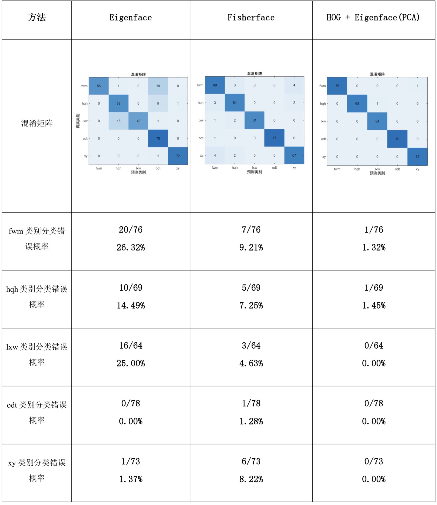

# Face-Recognition

## 项目简介

本项目是经典人脸识别技术的`MATLAB`实现，主要利用不同的算法进行人脸特征提取与识别。本科`计算机视觉与模式识别`课程实验代码。

## 主要内容

1. **Eigenface**: 基于特征脸的方法，通过主成分分析（PCA）提取人脸特征。
2. **Fisherface**: 使用线性判别分析（LDA）进行人脸识别，增强对不同人脸之间的区分能力。
3. **HOG + Eigenface**: 结合方向梯度直方图（HOG）特征与特征脸进行人脸识别，提高识别的准确性。

## 项目结构

- `src/`: 源代码，包含不同人脸识别算法的实现
  - **Face Collection**: 人脸采集模块
    - `main.ipynb`: Jupyter Notebook，用于采集和处理人脸数据
  - **FLD_based Face Recognition System**: 基于 FLD (Fisher Linear Discriminant) 的人脸识别系统
    - `CreateDatabase.m`: 创建人脸数据库
    - `FisherfaceCore.m`: Fisherface 算法核心
    - `Recognition.m`: 人脸识别主函数
    - `example.m`: 识别示例
    - `main.m`: 系统主入口
  - **HOG&PCA_based Face Recognition System**: 基于 HOG 和 PCA 的人脸识别系统
    - `CreateDatabase.m`: 创建人脸数据库
    - `EigenfaceCore.m`: Eigenface 算法核心
    - `EigenfaceRecognition.m`: Eigenface 识别函数
    - `main.m`: 系统主入口
  - **PCA_based Face Recognition System**: 基于 PCA (Principal Component Analysis) 的人脸识别系统
    - `CreateDatabase.m`: 创建人脸数据库
    - `EigenfaceCore.m`: Eigenface 算法核心
    - `Recognition.m`: 人脸识别主函数
    - `example.m`: 识别示例
    - `main.m`: 系统主入口

- `data/`: 数据集，采集的人脸数据（因隐私问题，未提供所用数据集）
  - 每个人的图像数据存储在对应的文件夹中，文件夹名称为该人的标识符